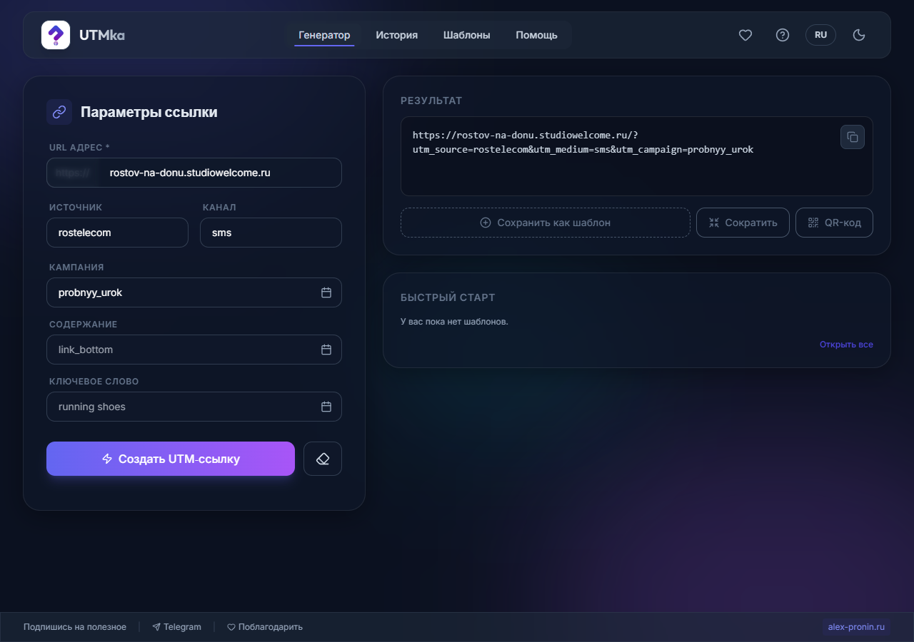
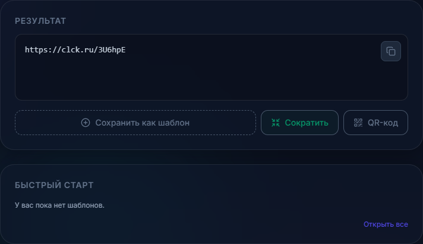
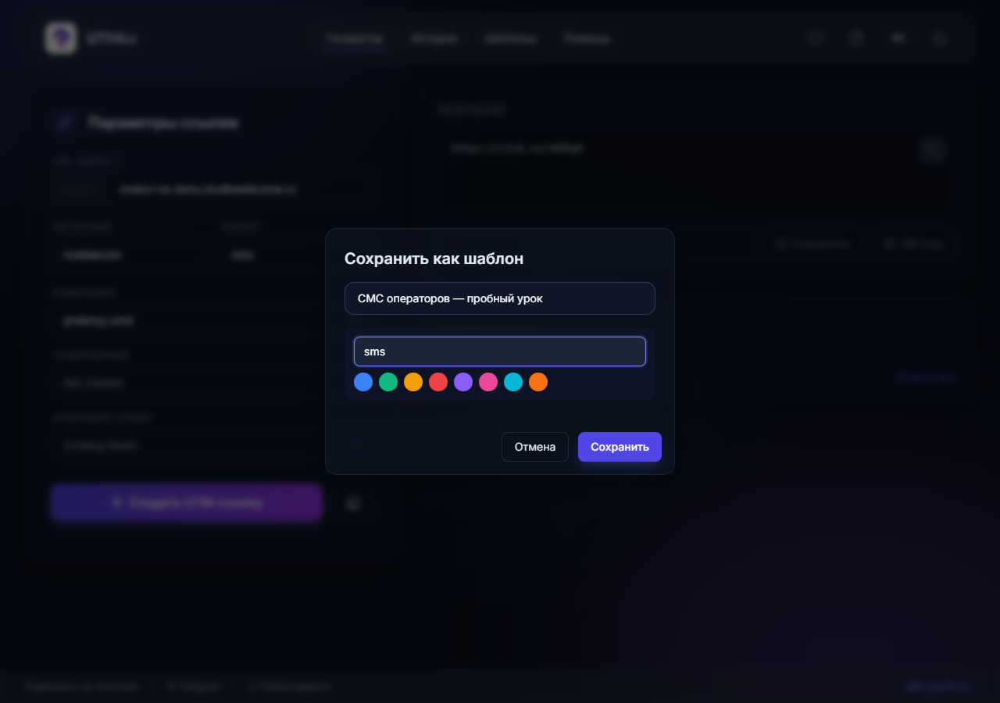
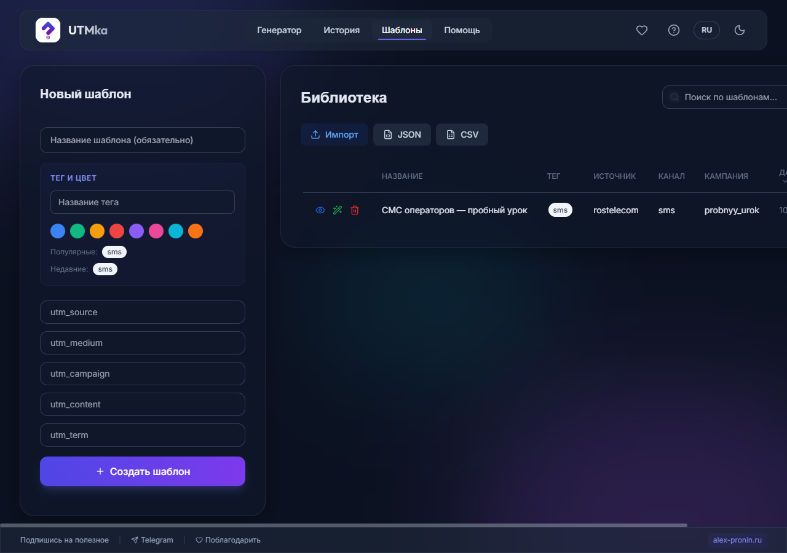

# Как пользоваться UTMka — инструкция для тех, кто впервые слышит про UTM

Эта памятка для человека, у которого стоит задача «начать делать UTM-метки», но который пока не понимает, что это вообще такое. Прочитаешь за 5 минут — и сделаешь первую ссылку.

---

## 1. Что такое UTM и зачем оно тебе

Представь, что ты публикуешь ссылку на свой сайт в трёх местах: в СМС-рассылке от оператора, в посте ВКонтакте и в рекламе Яндекса. Человек кликнул, пришёл на сайт. **Вопрос: откуда именно он пришёл?** Без меток — никак не узнать, все переходы сольются в кучу.

**UTM-метка** — это «хвостик», который дописывается к твоей ссылке. Он невидимо передаёт системе аналитики (Яндекс.Метрика, Google Analytics), откуда пришёл человек.

Было:
```
rostov-na-donu.studiowelcome.ru
```
Стало:
```
rostov-na-donu.studiowelcome.ru/?utm_source=rostelecom&utm_medium=sms&utm_campaign=probnyy_urok
```

Этот хвостик **не меняет, куда ведёт ссылка** — человек попадёт ровно на ту же страницу. Но теперь в аналитике ты увидишь: «50 человек пришли из СМС Ростелекома, 30 из ВК, 200 из рекламы Яндекса».

**UTMka просто собирает этот хвостик за тебя**, чтобы не писать его руками и не ошибаться.

---

## 2. Пять полей — что в них писать

На главном экране («Параметры ссылки») есть поля. Обязательно заполнять только **URL** и первые два-три параметра.

| Поле в приложении | Что это | Что писать (примеры) |
|---|---|---|
| **URL адрес** * | Куда ведёт ссылка — твоя страница | `rostov-na-donu.studiowelcome.ru` |
| **Источник** *(utm_source)* | **Откуда** идёт трафик — площадка/оператор | `rostelecom`, `tele2`, `vk`, `yandex` |
| **Канал** *(utm_medium)* | **Каким способом** пришёл человек | `sms`, `social` (соцсети), `cpc` (платная реклама), `email` |
| **Кампания** *(utm_campaign)* | Название твоей акции/повода | `probnyy_urok`, `summer_sale` |
| **Содержание** *(utm_content)* | Необязательно. Различать два объявления внутри одной кампании | `link_bottom`, `red_button` |
| **Ключевое слово** *(utm_term)* | Необязательно. Для контекстной рекламы | `running shoes` |

> Поле **URL адрес** уже содержит приписку `https://` слева — её писать не нужно, вводи сразу адрес сайта.

### Главное правило новичка
- Пиши **латиницей, маленькими буквами, без пробелов** (вместо пробела — нижнее подчёркивание `_`).
- ✅ `probnyy_urok`  ❌ `Пробный Урок`
- Договорись сам с собой о единых словах. Если сегодня оператор `tele2`, а завтра `tele-2` — в отчёте это будут два разных источника, и статистика «поедет».

---

## 3. Разбор реальной задачи: СМС-рассылка от Ростелекома

**Задача:** Ростелеком делает СМС-рассылку, в тексте сообщения — ссылка на страницу с заявкой на пробный урок (`rostov-na-donu.studiowelcome.ru`). Нужно добавить UTM и отдать им короткую ссылку.

Разложим задачу по полям:

| Поле | Значение | Почему так |
|---|---|---|
| URL адрес | `rostov-na-donu.studiowelcome.ru` | страница с заявкой на пробный урок |
| Источник | `rostelecom` | рассылку делает Ростелеком (для Теле2 будет `tele2`) |
| Канал | `sms` | это СМС-сообщение |
| Кампания | `probnyy_urok` | повод — приглашение на пробный урок |

Заполняем форму и жмём **«Создать UTM‑ссылку»**:



В блоке **«Результат»** появилась готовая ссылка:
```
https://rostov-na-donu.studiowelcome.ru/?utm_source=rostelecom&utm_medium=sms&utm_campaign=probnyy_urok
```

### Делаем короткую ссылку для СМС

Длинная ссылка в СМС выглядит страшно и «съедает» символы (а СМС тарифицируется по длине). Поэтому жмём кнопку **«Сократить»** — UTMka превратит её в короткую через сервис clck.ru:



Получилась короткая ссылка вида `https://clck.ru/3U6hpE`. Жмём **«Копировать»** — и именно её вставляем в текст СМС-сообщения для Ростелекома. При клике человек всё равно попадёт на нужную страницу, а в аналитике переход зачтётся как пришедший из СМС Ростелекома.

> ⚠️ Для кнопки «Сократить» нужен интернет — она обращается к внешнему сервису clck.ru.

---

## 4. Шаблоны — чтобы не собирать одно и то же заново

Рассылки операторов — история регулярная: сегодня Ростелеком, завтра Теле2, послезавтра снова Ростелеком, но с другим поводом. Чтобы каждый раз не заполнять поля заново и не путаться в написании, сохрани заготовку в **шаблон**.

После генерации ссылки нажми **«Сохранить как шаблон»**, дай понятное название и (по желанию) тег:



Все сохранённые шаблоны лежат во вкладке **«Шаблоны» → «Библиотека»**:



### Как повторно использовать ссылку/шаблон

Есть три способа не делать работу дважды:

1. **Применить шаблон.** В библиотеке шаблонов у каждой строки слева есть значок применения (галочка/стрелка). Нажимаешь — поля генератора заполняются сохранёнными значениями. Дальше меняешь только то, что отличается (например, оператора `rostelecom` → `tele2` или повод кампании), и жмёшь «Создать UTM‑ссылку».
2. **Повторить из Истории.** Вкладка **«История»** хранит все когда-либо созданные ссылки. Можно найти нужную, открыть и скопировать заново — удобно, когда надо просто ещё раз взять ту же самую ссылку.
3. **Импорт/экспорт.** Кнопки **JSON / CSV** в библиотеке позволяют выгрузить шаблоны файлом (например, для коллеги или на другой компьютер) и загрузить обратно через **«Импорт»**.

**Логика простая:** один раз настроил «рыбу» (URL + типовые источники/каналы) → дальше каждая новая рассылка это пара кликов: применил шаблон, поправил оператора и повод, сократил, скопировал.

---

## 5. Где смотреть, что уже наделал — История

Вкладка **«История»** хранит все созданные ссылки (последние 500). Можно искать, фильтровать по дате, копировать повторно, смотреть детали. Всё хранится **локально на твоём компьютере** — никаких аккаунтов и облака, ничего никуда не утекает.

---

## Шпаргалка на один экран

> 1. **URL адрес** — вставь свою страницу (без `https://`) →
> 2. **Источник** = откуда (rostelecom, tele2, vk) →
> 3. **Канал** = как (sms, social, cpc, email) →
> 4. **Кампания** = повод (probnyy_urok) →
> 5. **«Создать UTM‑ссылку»** → при необходимости **«Сократить»** → **«Копировать»** → вставляй в рассылку/пост.
>
> Всё латиницей, маленькими, без пробелов. Одинаковые слова всегда пиши одинаково.
> Регулярные рассылки сохраняй в **Шаблоны** — потом применяй в два клика.
